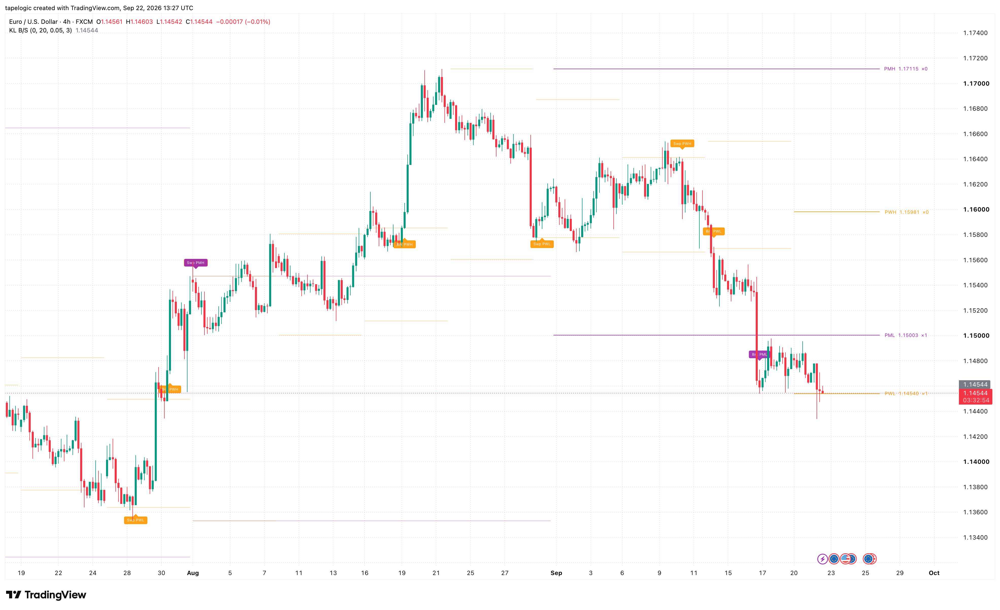
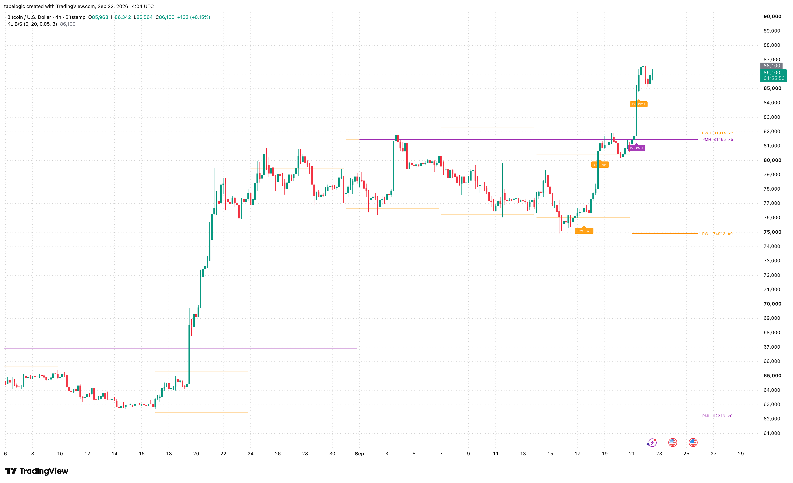

# pine-tools

TradingView / Pine Script tools I build for my own charts. Open source.

I trade crypto, FX and equities, and I write the indicators I want to have in
front of me. Everything here is v6 and non-repainting.

## Key Levels — Break & Sweep

Previous day, week and month highs and lows, with two confirmed behaviours
flagged at each level:

- **Break** — price closes beyond the level, and a later candle confirms in the
  same direction.
- **Sweep** — a wick pierces the level but the body closes back on the original
  side, and a later candle confirms the reversal.

Signals are evaluated only on closed bars, so nothing repaints. Each period
draws its own previous-period level as a continuous segment, so scrolling back
shows the levels that were actually valid at that time. The indicator picks
which level groups to show based on the chart timeframe.

Every confirmed signal fires an alert with the signal type, level name, level
price and ticker.

## Contact

Open an issue here, or message me on TradingView: tapelogic
